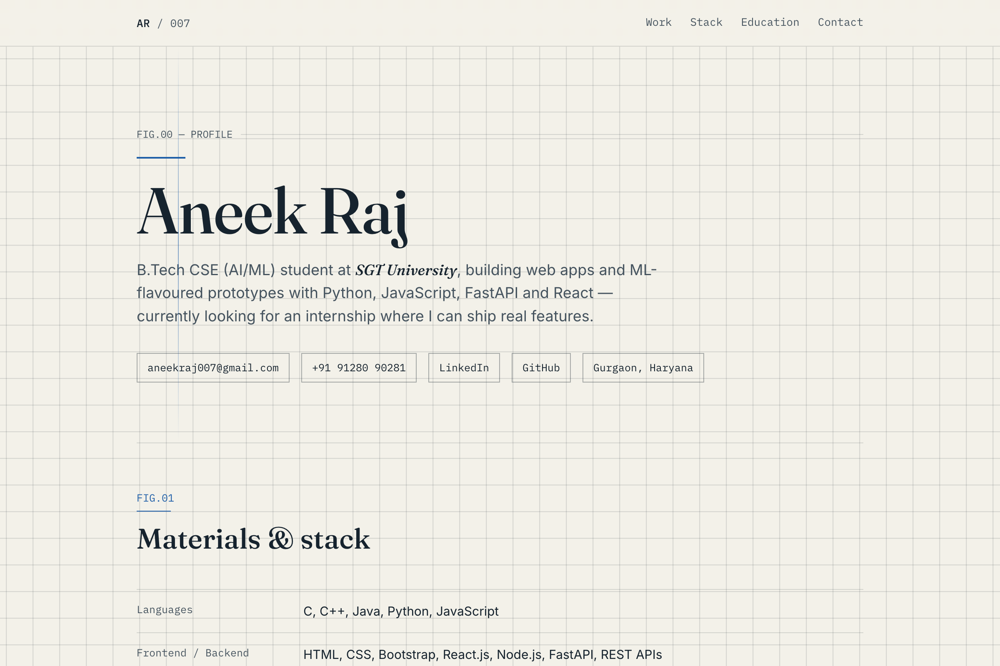

# Aneek Raj — Portfolio

> A minimal, editorial & technical blueprint-style personal portfolio website.

[](./index.html)

---

## 📌 Overview

This repository contains the personal portfolio website for **Aneek Raj**, a Computer Science & Engineering (AI/ML) student at SGT University. The design is inspired by architectural drafting sheets, technical specification documents, and editorial typography.

---

## ✨ Features

- **Blueprint & Technical Aesthetic**: Clean engineering grid background, figure labels (`FIG.00` – `FIG.05`), hairline dividers, and titleblock footer.
- **Refined Typography**: Balanced pairing of **Fraunces** (editorial display serif), **Inter** (modern UI sans-serif), and **IBM Plex Mono** (technical monospace).
- **Interactive Sections**:
  - **FIG.00 — Profile / Hero**: Introduction, status badge, and contact pills.
  - **FIG.01 — Materials & Stack**: Clean tabular breakdown of languages, frameworks, databases, and tools.
  - **FIG.02 — Experience**: Chronological internship and work history timeline.
  - **FIG.03 — Projects**: Highlighted builds (AI Voice Assistant, Virtual Try-On WebAR) with live metrics and tech tags.
  - **FIG.04 — Education & Certifications**: Academic background and industry certifications.
  - **FIG.05 — Additional Highlights**: Extracurricular achievements and hackathon records.
  - **Titleblock Footer**: Blueprint-style meta box with contact details and quick links.
- **Performance & Zero Dependencies**: Built with 100% semantic HTML5, pure vanilla CSS, and lightweight vanilla JavaScript. No heavy external frameworks required.
- **Smooth Reveal Animations**: Native `IntersectionObserver` scroll-triggered transitions with `prefers-reduced-motion` accessibility support.
- **Fully Responsive**: Optimized for ultra-wide monitors, laptops, tablets, and mobile devices.

---

## 🛠️ Tech Stack

- **Structure**: Semantic HTML5
- **Styling**: Vanilla CSS3 (Custom CSS variables, Grid, Flexbox, Micro-animations)
- **Scripting**: Vanilla JavaScript (IntersectionObserver for scroll animations)
- **Typography**: [Google Fonts](https://fonts.google.com/) (Fraunces, Inter, IBM Plex Mono)

---

## 📂 File Structure

```text
portfolio-site/
├── index.html       # Main HTML markup & structure
├── style.css        # Design system, styling, layout & animations
├── preview.png      # Portfolio screenshot preview
└── README.md        # Project documentation
```

---

## 🚀 Getting Started

You can run this project locally without any complex build tools.

### Option 1: Direct Open
Simply open `index.html` in your favorite web browser:
```bash
open index.html        # macOS
xdg-open index.html    # Linux
start index.html       # Windows
```

### Option 2: Local HTTP Server

Using Python:
```bash
# Python 3
python3 -m http.server 8000
```
Then visit [`http://localhost:8000`](http://localhost:8000) in your browser.

Using Node.js / `npx`:
```bash
npx serve .
```

---

## 🎨 Customization

To tailor this portfolio for your own profile:
1. **Personal Information**: Edit name, bio, links, and contact information in `index.html`.
2. **Projects & Experience**: Add or update cards in `<section class="panel" id="work">` and `<section class="panel">` (FIG.03).
3. **Colors & Theming**: Modify the CSS variables at the top of `style.css`:
   ```css
   :root {
     --bg: #f4efe6;          /* Background color */
     --fg: #151515;          /* Main text color */
     --accent-blue: #1f4e79; /* Blueprint blue accent */
     --amber: #b45309;       /* Status highlight */
     /* ... */
   }
   ```

---

## 📬 Contact & Socials

- **Email**: [aneekraj007@gmail.com](mailto:aneekraj007@gmail.com)
- **LinkedIn**: [linkedin.com/in/aneek-gupta-a65b7a242](https://www.linkedin.com/in/aneek-gupta-a65b7a242)
- **GitHub**: [@aneekraj007](https://github.com/aneekraj007)
- **Location**: Gurugram, Haryana, India

---

## 📄 License

This project is open source and available under the [MIT License](https://opensource.org/licenses/MIT).
